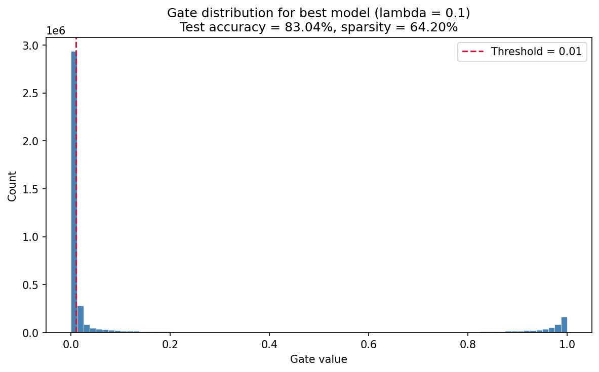

# Self-Pruning Neural Network Report

## Why an L1 Penalty on Sigmoid Gates Encourages Sparsity

Each prunable weight has its own learnable gate score. In the forward pass, that score is passed through a sigmoid:

`gate = sigmoid(gate_score)`

so the gate stays between 0 and 1. The layer then uses:

`effective_weight = weight * gate`

If a gate becomes very small, that weight has almost no effect on the output.  
To encourage this, the training loss includes an L1 penalty on the gate values:

`Total Loss = Classification Loss + lambda * Sparsity Loss`

The sparsity term is computed from the gates across all `PrunableLinear` layers. Since L1 regularization penalizes non-zero values directly, it naturally pushes unnecessary gates toward 0.  
In this implementation, any gate below the pruning threshold of `0.01` is counted as pruned and the corresponding weight is zeroed out during hard pruning.

## Results for Different Lambda Values

The table below shows the final test accuracy and sparsity level for the three values of `lambda` that were tested:

| Lambda | Test Accuracy (%) | Sparsity Level (%) |
| --- | ---: | ---: |
| 0.05 | 82.78 | 42.56 |
| 0.10 | 83.04 | 64.20 |
| 0.20 | 82.72 | 77.10 |

## Best Model Analysis

The best balance came from **lambda = 0.10**.

- Test Accuracy: **83.04%**
- Sparsity Level: **64.20%**

This setting kept the accuracy high while pruning almost two-thirds of the prunable weights, which makes it the most practical trade-off among the three runs.

## Gate Value Distribution for the Best Model

The plot below shows the final gate values for the best model:

This is the kind of distribution we want to see in a self-pruning model:

- There is a **large spike near 0**, which corresponds to weights that were effectively pruned.
- There is another **cluster of values away from 0, near 1**, which corresponds to important weights that stayed active.

This separation matters because it shows the network did not reduce all gates evenly.  
Instead, it learned to keep a useful set of connections active and push weaker ones close to zero.

## Trade-Off Summary

The three runs show the expected sparsity versus accuracy trade-off:

- A smaller lambda (`0.05`) keeps more connections, so sparsity is lower but accuracy remains strong.
- A medium lambda (`0.10`) gives the best overall balance between pruning and performance.
- A larger lambda (`0.20`) prunes more aggressively, which increases sparsity but causes a slight drop in accuracy.

Overall, the experiments show that the network is able to prune itself during training, and that the amount of pruning can be controlled through the lambda value.

## Runtime

The full experiment sweep took about **25 minutes** to run.
